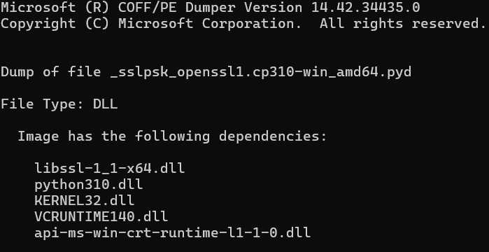

# iOS-17-SideJIT
A module to enable Just In Time Support for iOS devices >=17.0 &lt;17.4

## Overview
JIT or Just In Time Compilation is a method where code is compiled into machine code at runtime, allowing faster (near machine level) execution of codes. iOS being a heavily locked down Operating System does not allow native execution of code in its system. Therefore, we have to rely on JIT to achieve an acceptable amount of performance on resource intensive tasks.

Having established the fact that JIT is the best option (on a non-jailbroken device) to attain optimal performance in device; it is not easy to achieve. One of the options that seems to tackle that is -[SideJITServer](https://github.com/nythepegasus/SideJITServer) which is what I will be using for obtaining JIT access on iOS 17+.

> But SideJITServer already supports JIT on iOS 17+, what is the use of this?

SideJITServer relies on the latest version of [pymobiledevice3](https://github.com/doronz88/pymobiledevice3) that has removed the drivers required to achieve tunneling and thus attain JIT access through SideJITServer, which means, iOS versions 17.0 to 17.4 are now unsupported. This project aims to fix exactly that. The problems and workarounds are denoted in the following sections.

## Workflow
### The WeTest driver dependency
To achieve JIT on the above mentioned iOS versions through Windows, there is a closed source driver that achieves tunneling. This method of achieving tunneling used to be supported by pymobiledevice3, but after commit #970 or after version 4.4.1, the support was removed, and perhaps rightfully so. First, the driver was not open sourced, and second, it had a lot of bugs. The developers hence, decided to remove it. But, after going through the [commit logs](https://github.com/doronz88/pymobiledevice3/pull/970/commits/44035fa438cee151a238b46bf60cfe6f5208c739), I found out that installing drivers is as easy as invoking a function of a Python module called [pywintunx-pmd3](https://pypi.org/project/pywintunx-pmd3/1.0.2/) by -
```python
pywintunx_pmd3.install_wetest_driver()
```
which is precisely what I have implemented here.

### The OpenSSL conundrum
Even after installing the drivers, I encountered a weird error - a dependency called `sslpsk-pmd3` was giving me DLL errors about not being able to import a component
> DLL load failed while importing _sslpsk_openssl3: The specified module could not be found.

which was since given I had both pyOpenSSL and OpenSSL3 installed systemwide, and so, I decided to dive deeper.
```shell
dumpbin /dependents _sslpsk_openssl1.cp310-win_amd64.pyd
```
which gets me the following output -



Notice how the library depends on `libssl-1-1-x64.dll` which is not installed with OpenSSL3. To tackle this issue, I had to explicitly find the right version and point the interpreter to that directory.

### JIT still does not work
Even after all the dependencies are installed, for some reason, SideJITServer is still not able to create the endpoint required by the device to obtain access. To tackle that, I had to manually create the tunnel using pymobiledevice3 command which starts the tunnel at `localhost:49151`-
```shell
pymobiledevice3 remote tunneld
```
After the tunnel is created, I use the SideJITServer command to hoop in to the tunnel -
```shell
SideJITServer --tunnel
```
And, now the tunnel starts successfully. Obtaining JIT access is now as easy as just selecting the application in the SideStore client

---
## Todo
- [x] Dependency installation
- [x] Drivers
- [ ] OpenSSL libraries
- [ ] pymobiledevice3 tunnel creation
- [ ] JIT initialization through SideJITServer